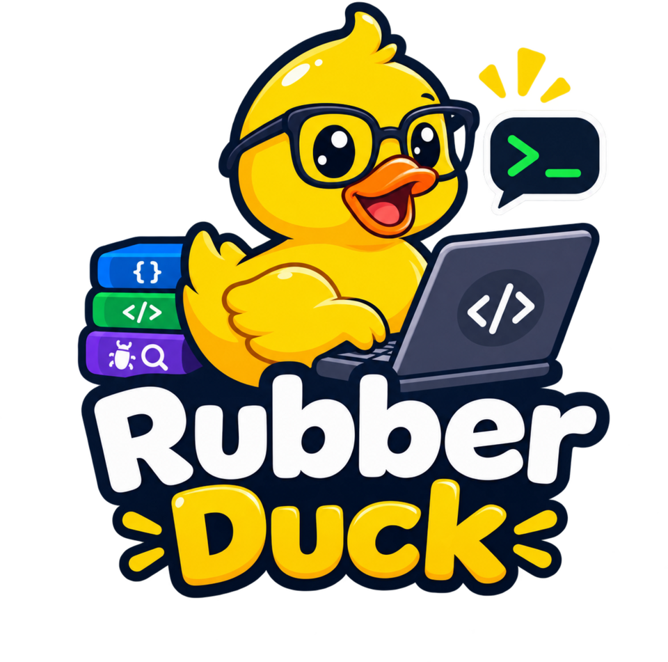

# Rubber Duck

<p align="center">
  
</p>

Rubber Duck is an AI-assisted debugging workspace that turns troubleshooting into an explicit, repeatable investigation:

`Problem → Evidence → Hypothesis → Test → Result → Conclusion`

## What it does

- Organizes debugging sessions, evidence, hypotheses, tests, and validated solutions.
- Offers Rubber Duck, Methodical Debugger, Technical Mentor, and Critical Incident modes.
- Detects and redacts common credential patterns before sending or persisting session data.
- Stores local sessions in the browser and builds a reusable knowledge base from solved cases.
- Uses Gemini when `GEMINI_API_KEY` is configured and falls back to a deterministic local engine otherwise.

## Stack

- Angular 21 with standalone components, signals, and strict TypeScript
- Angular SSR with an Express 5 server
- Tailwind CSS 4 and Angular Material icons
- Vitest through Angular's unit-test builder
- Google Gen AI SDK for optional Gemini-powered investigations

## Local development

Requirements: a current Node.js LTS release and npm.

```bash
npm ci
npm run dev
```

Open [http://localhost:3000](http://localhost:3000).

The app works without an API key by using its built-in fallback engine. To enable Gemini, provide the key only to the server process:

```bash
GEMINI_API_KEY=your_key npm run dev
```

Never place the key in client-side source code or commit it to the repository.

## Quality checks

```bash
npm run lint
npm test -- --watch=false
npm run build
```

The production build includes browser and server bundles. Run it locally with:

```bash
npm run serve:ssr:app
```

The SSR server listens on [http://localhost:4000](http://localhost:4000).

## Timewarp integration

Rubber Duck can import redacted causal traces from a local
[Timewarp](https://github.com/Rukafuu/TimeWarp) database. Build Timewarp and
register its cross-platform URL handler once:

```bash
timewarp protocol install --db ./timewarp.db
```

In Rubber Duck, select **Connect to Timewarp** and choose **Connect and request
access**. On Windows, Linux, and macOS, the browser launches the local handler,
starts or reuses the loopback bridge, performs one-time pairing, and requests
`trace:read`. Timewarp opens the approval command locally. The browser cannot
approve its own request: review the scope and reason, then type the exact grant
ID in the Timewarp terminal. Manual URL-and-token pairing remains available.

Imported traces become investigation evidence, causal diagnostics become
hypotheses, and the recorded-only replay command is added as a proposed test.

## Project structure

```text
src/app/components   Shared UI components
src/app/pages        Debug Studio and Knowledge Base views
src/app/services     Session state, AI integration, themes, and knowledge base
src/app/models       Debugging domain models
src/app/utils        Credential detection and redaction
src/server.ts        Express API, Gemini integration, and Angular SSR
public               Static brand assets
```
